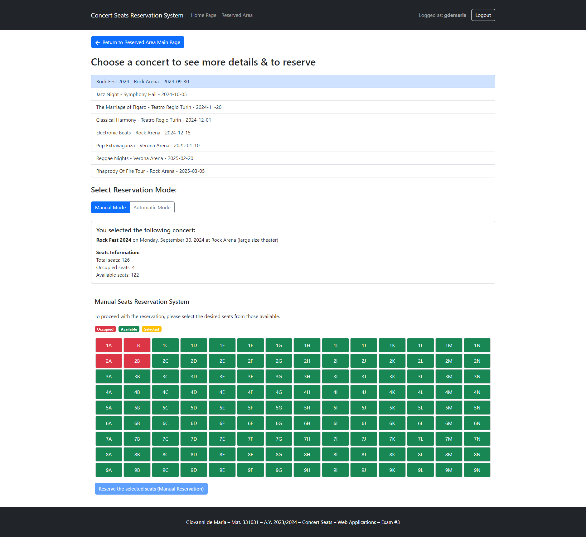

# Web Application Exam Project "Concert Seats Reservation System"

This is the project that I have done at Politecnico di Torino for the [Web Applications Exam](https://didattica.polito.it/pls/portal30/gap.pkg_guide.viewGap?p_cod_ins=01GYOUV&p_a_acc=2024&p_header=S&p_lang=&multi=N).

## Student: s331031 de Maria Giovanni

## React Client Application Routes

- Route `/`: Displays the home page with a concert selector in view mode. It allows users to browse available concerts and view details.
- Route `/reserved-area`: Manages the reserved area where authenticated users can view, add, or delete their reservations. It includes login functionality and displays the user's reservations.
- Route `/reserved-area/reserve`: Allows users to add new reservations with manual or automatic seat selection. User authentication is required.
- Route `/reserved-area/confirmed`: Displays a confirmation message after a reservation is successfully made.

## API Server

### In all the protected APIs

- if a non authenticated user tries to use a protected API receives in response the following error:
  - Error (401):
    ```json
    {
      "error": "Unauthorized"
    }
    ```

### GET `/session`

- **Description**: Retrieve the current session information of the authenticated user. If the user is authenticated, their session data is returned. If the user is not authenticated, an error is returned.

- **Response**:
  - Success (200): Returns the session information of the authenticated user.
    ```json
    {
      "username": "gdemaria",
      "user_id": 4,
      "displayed_name": "Giovanni de Maria"
    }
    ```
  - Error (401): User is not authenticated.
    ```json
    {
      "error": "Not authenticated"
    }
    ```

### POST `/login`

- **Description**: Authenticate a user.
- **Request Parameters**:
  - `username` (string): The user's username.
  - `password` (string): The user's password.
- **Response**:
  - Success (200):
    ```json
    {
      "username": "gdemaria",
      "user_id": 4,
      "displayed_name": "Giovanni de Maria"
    }
    ```
  - Error (401):
    ```json
    {
      "message": "Login failed"
    }
    ```
  - Error (500):
    ```json
    {
      "error": "Error message"
    }
    ```

### DELETE `/session`

- **Description**: Log out the authenticated user.
- **Response**:
  - Success (200):
    ```json
    {
      "message": "Logged out successfully"
    }
    ```
  - Error (500):
    ```json
    {
      "error": "Error message"
    }
    ```

### GET `/concerts`

- **Description**: Retrieve a list of all concerts.
- **Response**:

  - Success (200):

    ```json

    [
        {
            "concert_id": 1,
            "concert_name": "Rock Fest 2024",
            "concert_date": "2024-09-30",
            "theater_name": "Rock Arena",
            "theater_rows": 9,
            "theater_cols": 14,
            "theater_size": "large",
            "reserved_seats": ["1A","1B","2A","2B"]
        },
        {
            "concert_id": 2,
            "concert_name": "Jazz Night",
            "concert_date": "2024-10-05",
            "theater_name": "Symphony Hall",
            "theater_rows": 4,
            "theater_cols": 8,
            "theater_size": "small",
            "reserved_seats": ["1A","1B","2A","2B"]
        },
        {
            "concert_id": 3,
            "concert_name": "The Marriage of Figaro",
            "concert_date": "2024-11-20",
            "theater_name": "Teatro Regio Turin",
            "theater_rows": 6,
            "theater_cols": 10,
            "theater_size": "medium",
            "reserved_seats": []
        },
        ...
    ]
    ```

  - Error (500):
    ```json
    {
      "error": "Error message"
    }
    ```

### GET `/concert/:id`

- **Description**: Retrieve detailed information for a specific concert.
- **Request Parameters**:
  - `id` (int): The ID of the concert.
- **Response**:
  - Success (200):
    ```json
    {
      "concert_id": 1,
      "concert_name": "Rock Fest 2024",
      "concert_date": "2024-09-30",
      "theater_name": "Rock Arena",
      "theater_rows": 9,
      "theater_cols": 14,
      "theater_size": "large",
      "reserved_seats": ["1A", "1B", "2A", "2B"]
    }
    ```
  - Error (404):
    ```json
    {
      "error": "Concert not found"
    }
    ```
    - Error (422): Invalid concert ID.
    ```json
    {
      "errors": [
        {
          "msg": "Invalid concert ID",
          "param": "id",
          "location": "params"
        }
      ]
    }
    ```

Here’s the updated documentation with the condition that either `howMany` or `seat` must be used, but not both and not neither:

### POST `/reserve` (Random Seat Reservation)

- **Description**: Reserve a specified number of random seats for a concert. The `howMany` parameter must be provided, but not `seat`.
- **Authentication**: This endpoint requires the user to be authenticated (e.g., logged in).
- **Request Body**:
  - `concert_id` (int): The ID of the concert.
  - `howMany` (int): The number of random seats to reserve.
- **Constraints**:
  - The `howMany` parameter is required.
  - The request will fail if there are not enough available seats.
- **Response**:
  - Success (201):
    ```json
    {
      "message": "Reservation successful",
      "seats": ["1A", "2B", "3C"]
    }
    ```
  - Error (422): Invalid concert ID or howMany params.
    ```json
    {
      "errors": [
        {
          "msg": "Invalid concert ID",
          "param": "id",
          "location": "params"
        }
      ]
    }
    ```
  - Error (400): Not enough available seats to reserve.
    ```json
    {
      "error": "Not enough available seats"
    }
    ```
  - Error (400): Concert or theater not found.
    ```json
    {
      "error": "Concert or theater not found"
    }
    ```
  - Error (400): Seats already reserved.
    ```json
    {
      "message": "Seats already reserved",
      "error": "SQLITE_CONSTRAINT: UNIQUE constraint failed"
    }
    ```
  - Error (500): Internal server error.
    ```json
    {
      "message": "Reservation failed",
      "error": "An error message"
    }
    ```

### PUT `/reserve` (Specific Seat Reservation)

- **Description**: Reserve specific seats for a concert by providing seat numbers. The `seats` parameter must be provided, and each seat will be validated against the concert’s theater size and reserved seats.
- **Authentication**: This endpoint requires the user to be authenticated (e.g., logged in).
- **Request Body**:

  - `concert_id` (int): The ID of the concert.
  - `seats` (array of strings): An array of specific seats to reserve (e.g., `["1A", "2B"]`).

- **Constraints**:

  - The `seats` parameter is required.
  - The format for each seat must match the pattern of a row number followed by a capital letter (e.g., `1A`, `2B`).
  - The seat must be within the bounds of the theater size and not already reserved.

- **Response**:
  - Success (201):
    ```json
    {
      "message": "Reservation successful",
      "seats": ["1A", "2B"]
    }
    ```
  - Error (422): Invalid concert ID or seats params.
    ```json
    {
      "errors": [
        {
          "msg": "Invalid concert ID",
          "param": "id",
          "location": "params"
        }
      ]
    }
    ```
  - Error (422): Invalid seat format.
    ```json
    {
      "error": "Invalid seat format: 5Z"
    }
    ```
  - Error (400): Seat out of bounds for the theater size.
    ```json
    {
      "error": "Seat 7Z is out of bounds for theater size 6x5"
    }
    ```
  - Error (400): Concert or theater not found.
    ```json
    {
      "error": "Concert or theater not found"
    }
    ```
  - Error (400): Some seats are already reserved.
    ```json
    {
      "message": "Seats already reserved"
    }
    ```
  - Error (500): Internal server error.
    ```json
    {
      "message": "Reservation failed",
      "error": "An error message"
    }
    ```

### GET `/reservations`

- **Description**: Retrieve all reservations for the authenticated user.
- **Authentication**: This endpoint requires the user to be authenticated (e.g., logged in).
- **Response**:
  - Success (200):
    ```json
    [
      {
        "user_id": 1,
        "username": "emusk",
        "concert_id": 2,
        "concert_name": "Jazz Night",
        "concert_date": "2024-10-05",
        "theater_name": "Symphony Hall",
        "theater_rows": 4,
        "theater_cols": 8,
        "reserved_seats": ["1A","1B"]
      },
      {
        "user_id": 1,
        "username": "emusk",
        "concert_id": 7,
        "concert_name": "Reggae Nights",
        "concert_date": "2025-02-20",
        "theater_name": "Verona Arena",
        "theater_rows": 9,
        "theater_cols": 14,
        "reserved_seats": ["2A","2B"]
      },
    ...
    ]
    ```
  - Error (500): Internal server error.
    ```json
    {
      "error": "An error message"
    }
    ```

### DELETE `/reservation/:concertId`

- **Description**: Cancel the seats of the authenticated user for a specific concert.
- **Authentication**: This endpoint requires the user to be authenticated (e.g., logged in).
- **Request Parameters**:
  - `concertId` (int): The ID of the concert.
- **Response**:

  - Success (200):
    ```json
    {
      "message": "Reservation deleted successfully"
    }
    ```
  - Error (404):

    ```json
    {
      "error": "Reservation not found"
    }
    ```

  - Error (422): Invalid concert ID param.

    ```json
    {
      "errors": [
        {
          "msg": "Invalid concert ID",
          "param": "concertId",
          "location": "params"
        }
      ]
    }
    ```

  - Error (500): Internal server error.
    ```json
    {
      "message": "Reservation failed",
      "error": "An error message"
    }
    ```

### GET `/reservation/:concertId`

- **Description**: Retrieve the reservation details for a specific concert made by the authenticated user.
- **Authentication**: This endpoint requires the user to be authenticated (e.g., logged in).
- **Request Parameters**:
  - `concertId` (int): The ID of the concert for which the reservation was made.
- **Authentication**: This endpoint requires the user to be authenticated (e.g., logged in).
- **Response**:
  - Success (200): Returns the reservation details for the specified concert.
    ```json
    {
      "user_id": 1,
      "username": "emusk",
      "concert_id": 2,
      "concert_name": "Jazz Night",
      "concert_date": "2024-10-05",
      "theater_name": "Symphony Hall",
      "theater_rows": 4,
      "theater_cols": 8,
      "reserved_seats": ["1A", "1B"]
    }
    ```
  - Error (404): Reservation not found.
    ```json
    {
      "error": "Reservation not found"
    }
    ```
  - Error (422): Invalid concert ID.
    ```json
    {
      "errors": [
        {
          "msg": "Invalid concert ID",
          "param": "concertId",
          "location": "params"
        }
      ]
    }
    ```
  - Error (500): Internal server error.
    ```json
    {
      "error": "An error message"
    }
    ```

### GET `/get-token`

- **Description**: Get a JWT token for the authenticated user.
- **Authentication**: This endpoint requires the user to be authenticated (e.g., logged in).
- **Response**:
  - Success (200):
    ```json
    {
      "token": "jwtTokenString"
    }
    ```
  - Error (500): Internal server error.
    ```json
    {
      "message": "Reservation failed",
      "error": "An error message"
    }
    ```

## API Server2

### POST `/getDiscount`

- **Description**: Calculate a discount based on the seats and whether the user is loyal.
- **Request Body**:
  - `seats` (array of strings): An array of seat identifiers.
    - Example: `["1A","1B","2A","2B"]`
- **Response**:

  - Success (200):
    ```json
    {
      "discount": 25
    }
    ```
  - Error (400):

    ```json
    {
      "errors": [
        {
          "msg": "Seats are required and must be a non-empty string",
          "param": "seats",
          "location": "body"
        }
      ]
    }
    ```

  - Error (422):

    ```json
    {
      "error": "Invalid seat format: ..."
    }
    ```

  - Error (401):
    ```json
    {
      "error": "Invalid token. error: ..."
    }
    ```

#### Authorization

- **Description**: The API requires a JWT token for authorization.
- **Token Source**: The token must be provided in the `Authorization` header.
  - Example: `Authorization: Bearer <jwt_token>`
- **JWT Algorithm**: HS256
- **JWT Secret**: The API uses a secret key for signing the token: `qTX6walIEr47p7iXtTgLxDTXJRZYDC9egFjGLIn0rRiahB4T24T4d5f59CtyQmH8`.

#### Example JWT Payload

```json
{
  "user_id": 1,
  "username": "user123",
  "loyal": true
}
```

## Database Tables

### Table `theaters`

- Contains information about theaters where concerts are held.
- Columns:
  - `id` (integer, primary key): Unique identifier for each theater.
  - `name` (text): Name of the theater.
  - `rows` (integer): Number of seating rows in the theater.
  - `cols` (integer): Number of seats per row in the theater.
  - `size` (text): Size or capacity description of the theater.

### Table `concerts`

- Contains details about individual concerts held in various theaters.
- Columns:
  - `id` (integer, primary key): Unique identifier for each concert.
  - `name` (text): Name of the concert.
  - `theater_id` (integer, foreign key): Reference to the theater where the concert is held (from `theaters` table).
  - `date` (text): Date when the concert is scheduled.

### Table `users`

- Contains information about users who reserve concert seats.
- Columns:
  - `id` (integer, primary key): Unique identifier for each user.
  - `username` (text, not null): Unique username of the user.
  - `hashed_pwd` (text): Hashed password for user authentication.
  - `salt` (text): Salt used in password hashing.
  - `loyal` (integer, default 0, not null): Indicates if the user is a loyal customer (1 for yes, 0 for no).
  - `displayed_name` (text): Name displayed publicly for the user.
- Constraints:
  - `username` is unique across the table.
  - `loyal` can only have values of 0 or 1.

### Index `username`

A unique index is created on the `username` column of the table `users` to ensure that each username is unique across the table, preventing duplication and enhancing query performance.

### Table `reserved_seats`

- Tracks reserved seats for users attending concerts.
- Columns:
  - `user_id` (integer, foreign key): Reference to the user who reserved the seat (from `users` table).
  - `concert_id` (integer, foreign key): Reference to the concert where the seat is reserved (from `concerts` table).
  - `seat` (text): The specific seat number reserved for the concert.
- Constraints:
  - Primary key is a combination of `concert_id` and `seat` to ensure that each seat in a concert is reserved by only one user, avoiding inconsistent states in the database. This ensures data integrity at the database level.

### View `DetailedConcerts`

- Provides detailed information about concerts, including the theater and reserved seats.
- Columns:
  - `concert_id`: Unique identifier for the concert.
  - `concert_name`: Name of the concert.
  - `concert_date`: Date of the concert.
  - `theater_name`: Name of the theater where the concert is held.
  - `theater_rows`: Number of rows in the theater.
  - `theater_cols`: Number of seats per row in the theater.
  - `theater_size`: Description of the theater's size.
  - `reserved_seats`: Comma-separated list of reserved seats for the concert (if any).

### View `Reservations`

- Shows seat reservations for each user.
- Columns:
  - `user_id`: Unique identifier for the user.
  - `username`: Username of the user.
  - `concert_id`: Unique identifier for the concert.
  - `concert_name`: Name of the concert.
  - `concert_date`: Date of the concert.
  - `theater_name`: Name of the theater where the concert is held.
  - `theater_rows`: Number of rows in the theater.
  - `theater_cols`: Number of seats per row in the theater.
  - `reserved_seats`: Comma-separated list of seats reserved by the user for the concert.

## Main React Components

- `App` (in `App.jsx`): The main component that sets up the routing and navigation for the application (In this way the authenticated status is visible in all the application in the navbar). It manages user authentication and displays different pages based on the route.
- `Home` (in `Home.jsx`): Displays the home page with a concert selector and a seat viewer.
- `ReservedArea` (in `ReservedArea.jsx`): Manages the reserved area where authenticated users can view, add, or delete their reservations. It includes login functionality and displays the user's reservations.
- `ReservationCreatorPage` (in `ReservationCreatorPage.jsx`): Allows users to create new reservations. It supports both manual and automatic seat selection modes.
- `ConfirmationPage` (in `ConfirmationPage.jsx`): Displays a confirmation message after a reservation is successfully made. It also fetches and displays the discount from server2.
- `LoginForm` (in `components/LoginForm.jsx`): Provides a form for users to log in. It handles user authentication and displays error messages if login fails.
- `ConcertSelector` (in `components/ConcertSelector.jsx`): Allows users to select a concert from a list.
- `SeatsManager` (in `components/SeatsManager.jsx`): Manages the seat selection process for a concert. It displays available, occupied, and requested seats and handles seat reservation submissions for the manual mode.
- `AutomaticSeatsReserver` (in `components/AutomaticSeatsReserver.jsx`): Handles automatic seat reservation by allowing users to specify the number of seats they want to reserve. It integrates with the seat selection process.
- `SeatsStats` (in `components/SeatsStats.jsx`): Shows Total, Available, Requested, Occupied seats of a selected concert.
- `ReservationTable` (in `components/ReservationTable.jsx`): Displays a table of the user's current reservations with options to delete them.

## Screenshot



## Users Credentials

1. **Username**: emusk

   - **Password**: pwd1
   - **Loyal**: Yes
   - **Displayed Name**: Elon Musk

2. **Username**: sjobs

   - **Password**: pwd2
   - **Loyal**: Yes
   - **Displayed Name**: Steve Jobs

3. **Username**: cbrown

   - **Password**: pwd3
   - **Loyal**: No
   - **Displayed Name**: Charlie Brown

4. **Username**: gdemaria

   - **Password**: pwd4
   - **Loyal**: No
   - **Displayed Name**: Giovanni de Maria
